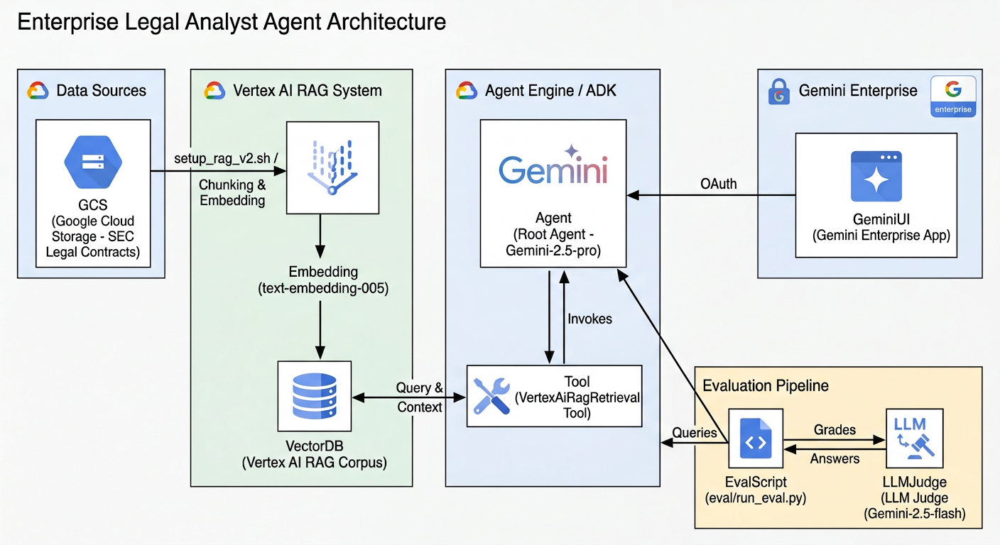

# Enterprise Legal Analyst Agent (Powered by Vertex AI RAG)

This repository contains an Enterprise-grade AI Agent built using the [Google Cloud ADK](https://google-cloud-adk.readthedocs.io/). It leverages **[Vertex AI RAG Engine](https://cloud.google.com/vertex-ai/docs/rag-overview)** to natively retrieve, synthesize, and analyze complex legal documentation (e.g., Master Agreements, Amendments, and Financial Schedules).

## Architecture & Goals



This agent demonstrates **Native RAG Integration** for high-stakes legal analysis. 
1.  **Managed Indexing**: Creates and maintains a managed RAG Corpus in Vertex AI containing highly complex SEC legal contracts.
2.  **Native Tool Binding**: Embeds the `VertexAiRagRetrieval` tool directly into the agent's reasoning loop.
3.  **Cross-Document Synthesis**: Empowers the agent to perform multi-hop reasoning, track clause overrides across amendments, and perform cross-family contract comparisons.

## Prerequisites

1.  **Google Cloud Project**: With Vertex AI APIs enabled.
2.  **Global Configuration**: Ensure the `.env` file in the repository root is configured with `PROJECT_ID`, `LOCATION`, `LEGAL_CORPUS`, and `RAG_CORPUS_NAME`.
3.  **Dependencies**: Install the required Python packages from the root `requirements.txt`.

## 1. Setup Data & Corpus

Before running the agent, you must create the RAG corpus and index the documents.

```bash
./setup_rag_v2.sh
```

This script reads configuration from the `.env` file, provisions a high-performance Vertex AI RAG corpus, and imports the legal contracts from Google Cloud Storage.

## 2. Local Execution

To run the agent locally in an interactive CLI environment, use the ADK `run` command:

```bash
adk run agent_with_rag
```

You can ask complex questions such as:
> *"Compare the 'Governing Law' and 'Dispute Resolution' clauses across the Bank of America and Goldman Sachs documents. Did any of these financial institutions change their preferred jurisdiction or arbitration rules via an amendment?"*

## 3. Cloud Deployment (Vertex AI Agent Engine)

This agent is fully compatible with **Vertex AI Agent Engine** (Reasoning Engine) for serverless cloud deployment.

Deploy the agent to your Google Cloud project using the following command:

```bash
source .env
adk deploy agent_engine agent_with_rag \
  --project $GOOGLE_CLOUD_PROJECT \
  --region $GOOGLE_CLOUD_LOCATION \
  --env_file .env
```

### Querying the Deployed Agent (REST API)

By design, ADK optimizes for streaming responses. The agent registers a high-performance streaming method (`streaming_agent_run_with_events`) rather than a basic synchronous query.

**Important (IAM Permissions):** When Agent Engine runs in the cloud, it uses its own dedicated [Reasoning Engine Service Agent](https://cloud.google.com/vertex-ai/generative-ai/docs/agent-engine/set-up#default-service-agent) (e.g., `service-123456789@gcp-sa-aiplatform-re.iam.gserviceaccount.com`, where the number is your Project Number). You **must** grant this specific service account the **[Vertex AI User](https://cloud.google.com/iam/docs/roles-permissions/aiplatform#aiplatform.user)** (`roles/aiplatform.user`) role in your project so the deployed agent has the necessary permissions to query the Vertex AI RAG corpus.

Once deployed and permissions are granted, you can query your agent using the following cURL command (replace `8492240784848846848` with your actual Reasoning Engine ID):

```bash
# We pipe the output to `jq` to parse the streaming JSON and extract only the agent's text answer.
curl -s -X POST "https://us-east1-aiplatform.googleapis.com/v1beta1/projects/${GOOGLE_CLOUD_PROJECT}/locations/${GOOGLE_CLOUD_LOCATION}/reasoningEngines/8492240784848846848:streamQuery" \
-H "Authorization: Bearer $(gcloud auth print-access-token)" \
-H "Content-Type: application/json" \
-d '{
  "classMethod": "streaming_agent_run_with_events",
  "input": {
    "request_json": "{\"user_id\": \"demo-user\", \"message\": {\"role\": \"user\", \"parts\": [{\"text\": \"Based on the original agreement and the subsequent amendments for The Walt Disney Company, what are the net-new compliance or reporting obligations imposed on the parties that were entirely absent from the original text?\"}]}}"
  }
}' | jq -r '.events[]?.content.parts[]?.text // empty'
```

*Note: You can also interact with your agent through the **Agent Space UI** in the Google Cloud Console, or integrate it into your downstream applications using the Vertex AI SDK.*

## 4. Evaluation & Validation

This repository includes an automated, LLM-as-a-judge evaluation pipeline designed to test the agent against rigorous, multi-hop legal analysis scenarios.

**Running the Evaluation:**

```bash
python3 eval/run_eval.py
```

This script will orchestrate queries against the live agent, evaluate the answers against a strict grading rubric, and output detailed reasoning and scores to `eval/evaluation_results.json`.

## 5. Registering the Agent with Gemini Enterprise

To make the deployed ADK agent available to users within the Gemini Enterprise web application, you must register it.

### Step 1: Configure OAuth Authorization
If your agent needs to access Google Cloud resources on behalf of a user, you must first [Create OAuth 2.0 credentials](https://docs.cloud.google.com/gemini/enterprise/docs/register-and-manage-an-adk-agent#obtain_authorization_details).

1. Go to the [Credentials page](https://console.cloud.google.com/apis/credentials) and create an **OAuth client ID** (Web application).
2. Add the following Authorized redirect URIs:
   - `https://vertexaisearch.cloud.google.com/oauth-redirect`
   - `https://vertexaisearch.cloud.google.com/static/oauth/oauth.html`
3. Download the JSON file containing your Client ID, Client secret, and URIs.

Because Gemini Enterprise apps often reside in multi-regions (e.g., `global`), while Reasoning Engines reside in specific regions (e.g., `us-east1`), UI registration can sometimes fail with location mismatch errors. To bypass this, we use the REST API.

**Add the Authorization Resource:**
```bash
curl -X POST \
  -H "Authorization: Bearer $(gcloud auth print-access-token)" \
  -H "Content-Type: application/json" \
  -H "X-Goog-User-Project: ${GOOGLE_CLOUD_PROJECT}" \
  "https://global-discoveryengine.googleapis.com/v1alpha/projects/${GOOGLE_CLOUD_PROJECT}/locations/global/authorizations?authorizationId=my-custom-auth" \
  -d '{
    "name": "projects/'${GOOGLE_CLOUD_PROJECT}'/locations/global/authorizations/my-custom-auth",
    "serverSideOauth2": {
      "clientId": "YOUR_OAUTH_CLIENT_ID",
      "clientSecret": "YOUR_OAUTH_CLIENT_SECRET",
      "authorizationUri": "https://accounts.google.com/o/oauth2/v2/auth?client_id=YOUR_OAUTH_CLIENT_ID&redirect_uri=https%3A%2F%2Fvertexaisearch.cloud.google.com%2Fstatic%2Foauth%2Foauth.html&scope=https://www.googleapis.com/auth/cloud-platform&include_granted_scopes=true&response_type=code&access_type=offline&prompt=consent",
      "tokenUri": "https://oauth2.googleapis.com/token"
    }
  }'
```

### Step 2: Register the ADK Agent
With the authorization in place, register the agent to your Gemini Enterprise App. You must provide the App ID of your Gemini Enterprise instance.

```bash
# Register the Agent
curl -X POST \
  -H "Authorization: Bearer $(gcloud auth print-access-token)" \
  -H "Content-Type: application/json" \
  -H "X-Goog-User-Project: ${GOOGLE_CLOUD_PROJECT}" \
  "https://global-discoveryengine.googleapis.com/v1alpha/projects/${GOOGLE_CLOUD_PROJECT}/locations/global/collections/default_collection/engines/YOUR_APP_ID/assistants/default_assistant/agents" \
  -d '{
    "displayName": "Legal RAG Agent",
    "description": "Enterprise-grade legal analyst powered by Vertex AI RAG.",
    "adkAgentDefinition": {
      "provisionedReasoningEngine": {
        "reasoningEngine": "projects/'${GOOGLE_CLOUD_PROJECT}'/locations/'${GOOGLE_CLOUD_LOCATION}'/reasoningEngines/YOUR_REASONING_ENGINE_ID"
      }
    },
    "authorizationConfig": {
      "toolAuthorizations": [
        "projects/YOUR_PROJECT_NUMBER/locations/global/authorizations/my-custom-auth"
      ]
    }
  }'
```

### Step 3: Add Permissioned Users
To allow users to access the registered agent within the Gemini Enterprise application, follow the official instructions to [Add or modify users and their permissions](https://docs.cloud.google.com/gemini/enterprise/docs/data-agent#set-permissions) in the Google Cloud console.

## Cleaning Up

To delete the RAG corpus and save costs:

```bash
./destroy_rag.sh
```
